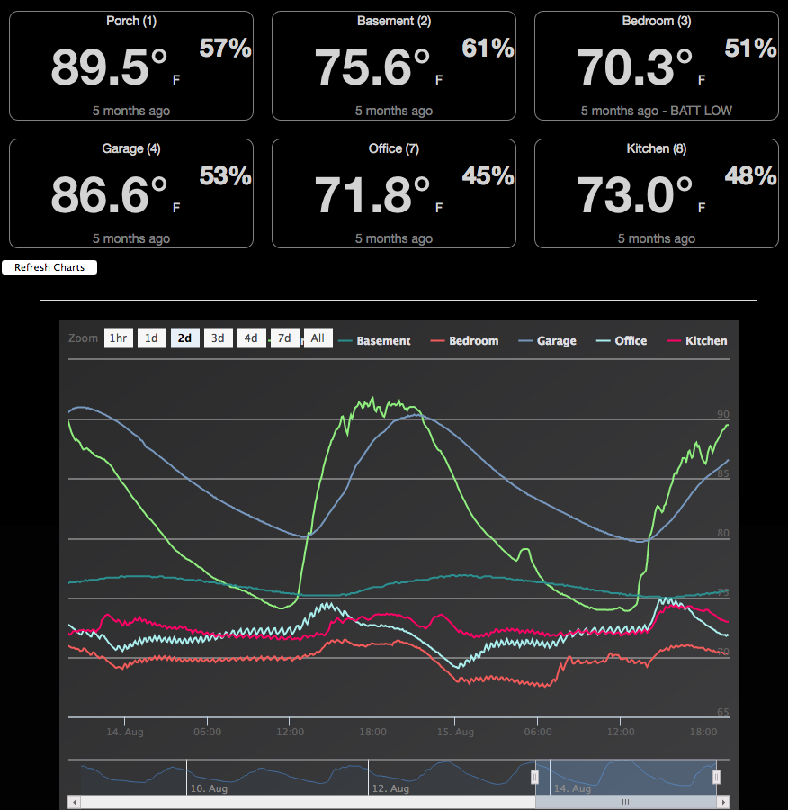

# temperature-server
A simple (prototype) web server to display temperature readings from wireless sensors

Written with node/express, html/js/jquery/knockout, highstocks (for charts).
It should be noted that this is a really old code, but it works.  I'll port this to newer frameworks and clean it up... one day...



## Prerequisites
- node & npm
- a source stream for temperature and humidity data (sample data included)

## How it works
A node script processes input from stdin that contains a stream of readings.  
It exposes a web server to show these readings, both current temps and a chart of 
historical readings (held in memory).  The web page polls the server for new readings.

To get it going (with included sample data), first clone this repo then:
```
cd temperature-server/web
npm install    ## (downloads the required node_modules)
cat sampledata.txt | node tempServer.js    
```
Then you should be able to open a web browser and point to port 8000, e.g.  http://localhost:8000/

The input format is very specific to my application, to use this in your own application, 
you probably want to hack at or replace the node script


## Example data
```
2016-08-08 00.00.04,1,Batt:ok, Id:1f/1, Temp: 82.1, Hum:84
2016-08-08 00.00.07,2,Batt:ok, Id:f3/4, Temp: 89.0, Hum:48
2016-08-08 00.00.20,3,Batt:ok, Id:99/2, Temp: 76.6, Hum:59
2016-08-08 00.00.29,4,Batt:lo, Id:40/3, Temp: 69.5, Hum:51
```
CSV columns are: timestamp, sequence number (ignored), battery status ('ok' or 'lo'), sensor id, temperature, humidity. 

## Configuration:
- the tempServer.js takes an optional argument to specify a different port than 8000
- config.js contains the names for the different sensor ids

## My TODO (eventually)
- Replace KO/jquery with angular or something newer
- Use bower or similar for JS dependencies
- Support a proper db; rrdtool or some other time-series database.
- replace the ad-hoc input format with something more standardized
- cosmetic (css) improvements
